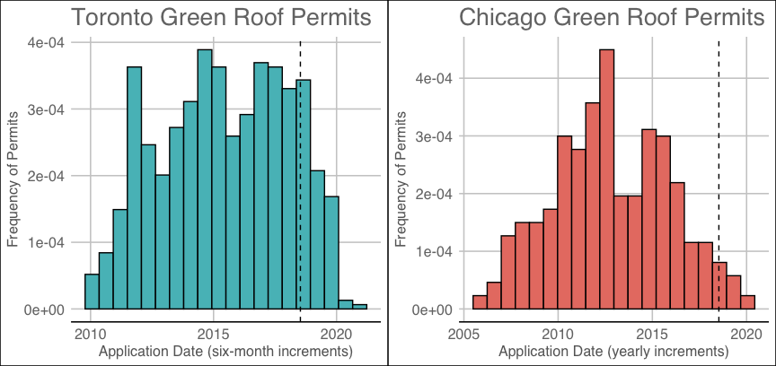
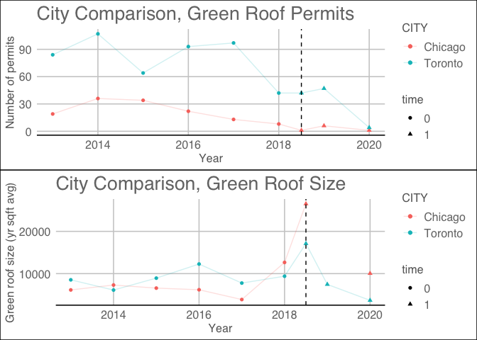

# Green Roofs in Toronto: Analyzing the Effect of Policy Change on Size, Frequency, and Neighborhood Prevalence

[Thomas Rosenthal](https://github.com/mrpotatocode) & [Qi Wen](https://github.com/vickywq)

March 10, 2020

### Abstract
*In this work, we have performed difference-in-difference OLS models to examine the relationship between 2018 policy to cancel existing renewable and green energy government contracts and the size, frequency, and neighborhood prevalence of green roofs in the city of Toronto. In order to run these models, we have used the city of Chicago, a leader in green roofing in the United States, as a control group. We have hypothesized that changes in green related policy, even if not directly associated with green roof permits, will lead to a decrease in both the number of permits and the size of the green roofs that are built. Our results have been limited by the relatively small number of permits issued since the policy change. Nonetheless, our results show a decrease in both permits and green roof area, although statistically non-significant. Additionally, applying this model to similar green roof permit datasets over time could help confirm the effect of policy changes or citywide trends that may emerge in the coming climate crisis.*

## Introduction

In July of 2018, newly elected Ontario Premier Doug Ford announced a
decision to cancel 758 “unnecessary and wasteful” renewable and green
energy government contracts. The mainstream news cycle focused on the
financial implications of the decision. This paper instead focuses on a
specific segment of renewable projects: green roofs. In 2009, the city
of Toronto adopted [The Green Roof
Bylaw](http://www.toronto.ca/legdocs/municode/1184_492.pdf) requiring
green roofs to be built for:

  - New commercial, institutional, and residential development with a
    minimum gross floor area of 2,000 m²;
  - New additions to commercial, institutional, and residential
    development where the new gross floor area added is greater than
    2,000 m²; and,
  - Industrial buildings greater than 2,000 m² gross floor area.

In addition to these minimums, the Toronto Green Roof Bylaw mandates the
ratio of green roof to total roof as building sizes increase (i.e. as
buildings become larger, ratios increase).

Green roofs are shown to be immensely beneficial within urban and
suburban settings. Studies have demonstrated that, when properly
implemented, the effects of green roofs include: lower city temperatures
in summer months and greater insulation in winter months, increased
effectiveness of rainfall absorption and water management systems,
cleaner city air quality from carbon sequestration, and improved health
of city-dwellers both human and otherwise. As such, green roofs have
become increasingly prevalent in large cities. This project will focus
on the policy change in Toronto and use the city of Chicago as a
comparative control (within North America, Toronto and Chicago are both
significant leaders in green roofed buildings).

In order to study the effect of this policy on green roofs in Toronto,
we have employed three difference-in-difference OLS models to explore
the relationship between the policy implementation and green roof size,
frequency, and neighborhood prevalence. The results of this are detailed
for each difference-in-difference model; however, they generally show a
statistically non-significant decrease in the number of green roof
permits in Toronto and its neighborhoods, as well as a decrease in green
roof area following the policy change. As such, conclusions regarding
this policy have not been drawn at this time. With these results, we
recommend further analysis to be conducted in 2023, five years after the
policy change, to see if more significant conclusions can be drawn.

### Research Question

The question posed is: has Doug Ford’s cancellation of green contracts
led to a change in green roof permits and areas within the city of
Toronto? Because the Green Roof Bylaw is still in effect for new
buildings, this change might appear as fewer proposals for new buildings
*or* proposals for smaller buildings requiring smaller \[green
roof:total roof\] ratios.

### Limitations

Two limitations have been identified within this project.

Firstly, this policy change is very recent. Thus, data falls
disproportionately to *before policy*. While it is certainly reasonable
to explore immediate effect of policy changes, data might not
definitively suggest an effect by the policy until sufficient *after
policy* data is present. This is demonstrated in *Figure 1*, where the
policy date is indicated relative to the number of permits within each
dataset.

Secondly, the Chicago dataset had a significant number of missing values
for green roof area (see §Data Cleaning and Structure). Unlike the
Toronto dataset, the Chicago dataset was not limited to green roof
permits, and extracting them was a somewhat manual process. In this
regard, some permits may have been missed if certain keywords were not
used in permit descriptions.

The effect of these limitations has likely created compounding effects
due to limited data after the policy and limited green roof area
measures, especially in Chicago.

### Ethics, Biases, and Assumptions

The ethical implications of this analysis are fairly minimal. The
results within refer to a specific time-based event, and its effects are
strictly comparative. Extrapolation of similar policy decisions would be
difficult unless specifically limited to Toronto \[or Chicago\]. The
prevalence of green roofs in both Toronto and Chicago has been noted for
over a decade, and these cities continue to lead their respective
countries in their efforts.

However, there is recognizable bias. Personal interest in green roofs
contributed to the decision to analyze this dataset in the first place.
Moreover, whilst Doug Ford’s decision was deemed by the PC party to be
an economic one, evidence to the contrary suggests that the Premier is
implementing policy more consistent with “climate-denier” politicians.
In this regard, although the initial research question as to whether or
not policy changes would affect green roof permits was neutrally posed,
the commentary resulting from the subsequent analysis is likely to
perpetuate author biases.

Additionally, this dataset treats green roofs to be wholly beneficial.
This is generally a logical argument; green roofs have myriad positive
effects for cities and their inhabitants, with few negative effects
aside from increased building and maintenance costs. Both of these
factors have been argued for and against. Nonetheless, further research
into the design and engineering of green roofs emphasizes that green
roofs must be properly implemented to avoid potential negative
externalities. Three notable issues are highlighted here:

  - Improper structural support must be established to maintain the
    additional green matter mass. This is especially critical during
    renovations, where structural supports have not been designed with
    green roofs in mind. Although building collapses have been rare,
    three notable events were examined in case study (Li 2019): 1) City
    University sports hall in Hong Kong (2016), which ultimately led to
    the removal of many green roofs in Hong Kong; 2) an unspecified
    building in St. Charles, Illinois (2011), where heavy snowfall led
    to considerable weight with inadequate water runoff; and 3) Zolitūde
    shopping centre in Riga, Latvia (2013), which led to 54 deaths
    following a series of inadequate emergency protocols. Prior to these
    collapses, bivariate analysis in 2009 suggested that 15% of existing
    buildings were suitable for green roofs within Melbourne (Wilkinson
    and Reed 2009).
  - Groundwater contamination from green roof runoff remains possible
    for hurried green roof implementations (Berardi, et al. 2013). Green
    roofs properly implemented generally reduce metal contents in city
    water (e.g. zinc, cadmium, copper, lead) but improperly implemented
    can result in harmful phosphate and nitrate leakage.
  - Green roof slope affects water retention (DeNardo, et al. 2005).
    This is essential to proper implementation, as green roofs are
    increasingly being used to alleviate stormwater runoff problems
    (Getter, et al. 2007). Nonetheless, aesthetic or cost-saving
    decisions may affect water retention possibilities and render a
    green roof superfluous or ineffective.

This dataset and the analysis within do not purport to know the
structural support, groundwater effect, or slope of each individual
green roof permit and assumes that these engineering standards were met
at the time of implementation. Additionally, whilst arguments made
within this analysis are encouraging implementations of green roofs,
this presumes that due diligence will be taken to avoid collapse.

### Dataset

The datasets used in the following analysis are [Building Permits -
Green
Roofs](https://open.toronto.ca/dataset/building-permits-green-roofs/)
from Toronto Open Data Portal and [Building
Permits](https://data.cityofchicago.org/Buildings/Building-Permits/ydr8-5enu/data#Export)
from the City of Chicago Data Portal. The former dataset contains
information about green roof construction in Toronto and the latter
contains similar information about Chicago. Twelve columns were
available in both datasets, including application date, permit
description, issued date, permit number, permit type, street direction,
street name, street number, street type, and green roof area. Green roof
areas in Toronto were measured in m² and thus converted to ft².
Neighborhood was derived from permit addresses in both cities (see §Data
Cleaning and Structure). Application dates spanned from 2010 to 2019 for
Toronto and from 2005 to 2020 for Chicago. The Chicago dataset did not
explicitly list green roof area, which was therefore extracted from
permit descriptions. There were some missing values for green roof area
in both datasets.

### Data Cleaning and Structure

Datasets were initially clean but contained some duplication where
permits had been revised and resubmitted. Crucial columns were available
in both datasets, and each dataset was pared down to common columns only
without significant loss of information. Using the skim function from
the skimr package, both datasets contained few if any missing values for
nearly all columns, except for green roof area. Toronto was missing 10
green roof area values (~1.5%), whereas Chicago was missing 139 (~56%).
As can be seen in *Table 1*, the mean square footage for green roof area
in Toronto is (M = 9542, SD = 22577), and in *Table 2* the mean square
footage for green roof area in Chicago is (M = 6778, SD = 10688). Both
datasets show good normality for yearly distribution of permits. The
number of permits per year for each city (Chicago, red:Toronto, blue) is
displayed in *Figure 1*.

In order to add neighborhood to each dataset, address details (street
direction, street name, street number, street type) from each dataset
were queried using GGMap and a Google Maps API Key.

Open Data Toronto provided a
[Neighbourhoods](https://open.toronto.ca/dataset/neighbourhoods/)
dataset. Within this dataset, a spatial polygon was provided from which
lat/long coordinates were programmatically tested to check which
neighborhood polygon coordinates fell within. GGMap and the API key were
used to generate lat/long coordinates for each address. This was
subsequently produced as a csv before attaching each address, its
coordinates, and its neighborhood to the Toronto permit details.

Chicago neighborhoods were approached differently, using GGMap and the
API key to generate lat/long coordinates for each address. These
coordinates were then reverse geocoded into GGMap again and neighborhood
details were provided in the resulting list set. Toronto neighborhoods
were inadequately described by this process (i.e. Toronto was broken
into its now-amalgamated municipalities (Etobicoke, Old Toronto, York,
North York, Scarborough, East York) rather than neighborhoods
(e.g. University, Financial District, Harbourfront, etc.)). The GGMap
process did not allow addresses to be queried directly, so the process
required some redundancy (converting addresses to coordinates and then
back to addresses again). Like Toronto, this was subsequently produced
as a csv before attaching each address, its coordinates, and its
neighborhood to the Chicago permit details.

These datasets were unioned on common columns, then summarized for each
difference-in-difference OLS model. These summarized datasets are
generally similar, when viewing the number of permits over a yearly
basis and the yearly mean of green roof areas for each city. Summarized
datasets were filtered for permits from 2013 (5 years prior to policy
change) to 2020 (most recent value), see *Figure 2*.

|                                                  |                  |
| :----------------------------------------------- | :--------------- |
| Name                                             | toronto\_permits |
| Number of rows                                   | 738              |
| Number of columns                                | 5                |
| \_\_\_\_\_\_\_\_\_\_\_\_\_\_\_\_\_\_\_\_\_\_\_   |                  |
| Column type frequency:                           |                  |
| character                                        | 2                |
| Date                                             | 1                |
| numeric                                          | 2                |
| \_\_\_\_\_\_\_\_\_\_\_\_\_\_\_\_\_\_\_\_\_\_\_\_ |                  |
| Group variables                                  |                  |

Data summary

**Variable type:
character**

| skim\_variable | n\_missing | complete\_rate | min | max | empty | n\_unique | whitespace |
| :------------- | ---------: | -------------: | --: | --: | ----: | --------: | ---------: |
| city           |          0 |              1 |   7 |   7 |     0 |         1 |          0 |
| neighborhood   |          0 |              1 |  10 |  40 |     0 |       117 |          0 |

**Variable type:
Date**

| skim\_variable    | n\_missing | complete\_rate | min        | max        | median     | n\_unique |
| :---------------- | ---------: | -------------: | :--------- | :--------- | :--------- | --------: |
| APPLICATION\_DATE |          0 |              1 | 2010-02-08 | 2020-12-24 | 2015-06-16 |       570 |

**Variable type:
numeric**

| skim\_variable    | n\_missing | complete\_rate |    mean |       sd |   p0 |     p25 |     p50 |     p75 |     p100 | hist  |
| :---------------- | ---------: | -------------: | ------: | -------: | ---: | ------: | ------: | ------: | -------: | :---- |
| green\_roof\_area |         10 |           0.99 | 9535.56 | 22523.11 |    0 | 2168.93 | 5112.85 | 9848.97 | 428790.7 | ▇▁▁▁▁ |
| year              |          0 |           1.00 | 2014.84 |     2.56 | 2010 | 2013.00 | 2015.00 | 2017.00 |   2020.0 | ▆▇▆▇▂ |

*Table 1*

|                                                  |                  |
| :----------------------------------------------- | :--------------- |
| Name                                             | chicago\_permits |
| Number of rows                                   | 318              |
| Number of columns                                | 5                |
| \_\_\_\_\_\_\_\_\_\_\_\_\_\_\_\_\_\_\_\_\_\_\_   |                  |
| Column type frequency:                           |                  |
| character                                        | 2                |
| Date                                             | 1                |
| numeric                                          | 2                |
| \_\_\_\_\_\_\_\_\_\_\_\_\_\_\_\_\_\_\_\_\_\_\_\_ |                  |
| Group variables                                  |                  |

Data summary

**Variable type:
character**

| skim\_variable | n\_missing | complete\_rate | min | max | empty | n\_unique | whitespace |
| :------------- | ---------: | -------------: | --: | --: | ----: | --------: | ---------: |
| city           |          0 |              1 |   7 |   7 |     0 |         1 |          0 |
| neighborhood   |          0 |              1 |   6 |  22 |     0 |        86 |          0 |

**Variable type:
Date**

| skim\_variable    | n\_missing | complete\_rate | min        | max        | median     | n\_unique |
| :---------------- | ---------: | -------------: | :--------- | :--------- | :--------- | --------: |
| application\_date |          0 |              1 | 2005-11-03 | 2020-01-14 | 2012-07-20 |       288 |

**Variable type:
numeric**

| skim\_variable    | n\_missing | complete\_rate |    mean |       sd |   p0 |    p25 |  p50 |  p75 |  p100 | hist  |
| :---------------- | ---------: | -------------: | ------: | -------: | ---: | -----: | ---: | ---: | ----: | :---- |
| green\_roof\_area |        139 |           0.56 | 6778.15 | 10688.57 |   80 | 1352.5 | 3300 | 7891 | 83759 | ▇▁▁▁▁ |
| year              |          0 |           1.00 | 2012.31 |     3.11 | 2005 | 2010.0 | 2012 | 2015 |  2020 | ▃▆▇▅▁ |

*Table 2*

<!-- -->

*Figure 1, the dashed line represents the policy change date*

## Difference in Difference Models

Three difference-in-difference models were developed: 1) Roof Size, 2)
Number of Permits, and 3) Neighborhood Prevalence. The models were built
using the Toronto green roof dataset as treatment group and Chicago
green roof dataset as control group. Data before the date 2018/07/18 was
considered as pre-treatment data because the policy was implemented in
Toronto on this date. The control group data was divided in the same
manner. *Figure 2* compares Chicago (red) and Toronto (blue) between
2013 and 2020 for two metrics: Number of Permits and the yearly mean of
Green Roof Areas (in square footage). *(Note: Chicago had green roof
permits in 2019, but no descriptions contained sq ft, so the value is
unknown).*

These difference-in-difference models were chosen as the method of
modelling because we were unable to explicitly create treatment and
control groups keeping all factors equal aside from policy
implementation. As such, we examined the difference in the number of
green roof permits (yearly total and neighborhood prevalence) and the
yearly average of green roof areas before 2018/07/18, and the difference
in the differences following the policy change on this date. Analysis of
difference-in-difference models can be done by conducting ordinary least
squares regression (OLS). The general equation is: Yi = α + βTi + γti +
δ (Ti · ti) + εi. Yi is the outcome of change we are interested in, Ti
can represent two groups depending on i (0 for control group and 1 for
treatment group), ti is the time dummy variable where t0 indicates a
time period before the treatment group receives treatment
(i.e. pre-treatment) and 1 indicates a time period after the treatment
group receives treatment (i.e. post-treatment). The coefficient δ is of
primary interest because it reflects the effect of treatment.

There are four assumptions for difference-in-difference models that need
to be tested. First, and most important, we must test for parallel
trends, which requires the difference between the treatment group and
control group to be constant without treatment. Although it cannot be
verified by statistical tests, visual inspection can be done by plotting
response variables (roof size, number of permits) over the time period.
The top graph in *Figure 2* shows that there is a parallel trend in
Chicago and Toronto before 2014, but it is violated between 2014 and
2018. It is still acceptable because we cannot expect the real-life data
pattern to be exactly constant and their trend remains similar overall.
The bottom graph shows that the parallel trend is totally violated.
Second, we must consider compositional change. Since the policy is
limited to a municipality, it is not easily transferable, and thus this
assumption is satisfied. Third, we must consider term effects against
reliability. Longer terms may introduce other factors to affect
outcomes. Six years of data is a reasonable time period for green roofs,
considering the construction time and permit process, so this assumption
is also satisfied. Fourth, we must consider functional form dependence,
which verifies if different functional forms of variables would affect
the results. Tests with different functional forms such as log() found
that the sign (+/-) of the coefficient was the same. Since we are
interested in whether the policy increased or decreased the roof area or
the number of green roof permits, the same sign means that the
functional form did not affect the results. Therefore, the fourth
assumption is satisfied.

<!-- -->

*Figure 2, the dashed line represents the policy change date*

### Roof Size

*Table 3* displays results for the Roof Size OLS model for mean green
roof area (roof size) and the interaction between treatment group and
time \[before/after policy\]. *(Note: within all models, `*` indicates
control and treatment groups were separate.)* The δ of this OLS model is
-8063.972, which illustrates that the mean green roof area in Toronto
after policy change is around 8064 less than in Toronto before. It is
worth noting that the p-value of this coefficient is larger than 0.05,
and as such the results are not statistically significant.

    ## # A tibble: 4 x 5
    ##   term                   estimate std.error statistic p.value
    ##   <chr>                     <dbl>     <dbl>     <dbl>   <dbl>
    ## 1 (Intercept)               7124.     1947.     3.66  0.00289
    ## 2 treatment_group1          1712.     2753.     0.622 0.545  
    ## 3 time1                    11153.     3894.     2.86  0.0133 
    ## 4 treatment_group1:time1  -10572.     5151.    -2.05  0.0608

*Table 3*

### Number of Permits

*Table 4* displays results for the Number of Permits OLS model for total
permits and the interaction between treatment group and time. The δ of
this OLS model is -16.66, which illustrates that the number of permits
in Toronto after policy change is around 17 less than in Toronto before.
The p-value of this coefficient is 0.379, also indicating that the
results are not statistically significant.

    ## # A tibble: 4 x 5
    ##   term                   estimate std.error statistic   p.value
    ##   <chr>                     <dbl>     <dbl>     <dbl>     <dbl>
    ## 1 (Intercept)                22.0      7.44      2.96 0.0104   
    ## 2 treatment_group1           59.2     10.5       5.63 0.0000624
    ## 3 time1                     -19.3     12.9      -1.50 0.155    
    ## 4 treatment_group1:time1    -30.8     18.2      -1.69 0.113

*Table 4*

### Neighborhoods

*Table 5* displays results for the Neighborhood Prevalence OLS model for
total permits per neighborhood *(this summarized dataset is not per
annum)* and the interaction between treatment group and time. The δ of
this OLS model is -0.77, which illustrates that the number of permits in
Toronto neighborhoods following the policy change is around 0.77 less
than in Toronto neighborhoods before. The p-value of this coefficient is
0.682, and also not significant.

    ## # A tibble: 4 x 5
    ##   term                   estimate std.error statistic   p.value
    ##   <chr>                     <dbl>     <dbl>     <dbl>     <dbl>
    ## 1 (Intercept)               2.64      0.625     4.22  0.0000359
    ## 2 treatment_group1          1.83      0.755     2.42  0.0163   
    ## 3 time1                    -1.64      1.68     -0.974 0.331    
    ## 4 treatment_group1:time1   -0.806     1.85     -0.435 0.664

*Table 5*

All three OLS models illustrate a decrease in green roof area and number
of permits in Toronto and within the city’s neighborhoods. Given the
non-significant results, we cannot know if this change has been caused
by Doug Ford’s 2018 policy change. As mentioned in §Limitations, the
result is potentially influenced by lack of total permits or missing
green roof area values. The slight violation of parallel trend
assumption is another potentially influencing factor.

## Conclusion

Green roofs continue to be a popular innovation in the world’s largest
cities. This report used the Building Permits - Green Roofs dataset from
Open Data Toronto and Building Permits from the city of Chicago data
portal to analyze whether policy change by Premier Doug Ford to cancel
existing renewable and green energy government contracts affected the
size, frequency, and neighborhood prevalence of green roofs in Toronto.
With the statistical non-significance of all three model outcomes, we
have emphasized the process required to develop a dataset combining
multiple cities and run difference-in-difference OLS models. In this
regard, we hope to facilitate future efforts to explore green roof
policy changes, review bylaws, or identify citywide trends that will
likely be necessary to aid in the coming climate crisis.

## References

Baptiste Auguie (2017). gridExtra: Miscellaneous Functions for “Grid”
Graphics. R package version 2.3.
<https://CRAN.R-project.org/package=gridExtra>

Berardi, U., Ghaffarianhoseini, A., & Ghaffarianhoseini, A. (2014).
State-of-the-art analysis of the environmental benefits of green roofs.
Applied Energy, 115, 411–428. doi: 10.1016/j.apenergy.2013.10.047

D. Kahle and H. Wickham. ggmap: Spatial Visualization with ggplot2. The
R Journal, 5(1), 144-161. URL
<http://journal.r-project.org/archive/2013-1/kahle-wickham.pdf>

David Robinson and Alex Hayes (2020). broom: Convert Statistical
Analysis Objects into Tidy Tibbles. R package version 0.5.4.
<https://CRAN.R-project.org/package=broom>

DeNardo, J.C., Jarrett, A.R., Manbeck, H.B., Beattie, D.J. & Berghage,
R.D., Stormwater mitigation and surface temperature reduction by green
roofs. *Transactions of the ASAE*, 48(5), pp. 1491–1496, 2005.

Elin Waring, Michael Quinn, Amelia McNamara, Eduardo Arino de la Rubia,
Hao Zhu and Shannon Ellis (2019). skimr: Compact and Flexible Summaries
of Data. R package version 2.0.2.
<https://CRAN.R-project.org/package=skimr>

G. Grothendieck (2017). sqldf: Manipulate R Data Frames Using SQL. R
package version 0.4-11. <https://CRAN.R-project.org/package=sqldf>

Garrett Grolemund, Hadley Wickham (2011). Dates and Times Made Easy with
lubridate. Journal of Statistical Software, 40(3), 1-25. URL
<http://www.jstatsoft.org/v40/i03/>.

Getter, K. L., Rowe, D. B., & Andresen, J. A. (2007). Quantifying the
effect of slope on extensive green roof stormwater retention. Ecological
Engineering, 31(4), 225–231. doi: 10.1016/j.ecoleng.2007.06.004

Green roof. (2020, March 19). Retrieved from
<https://en.wikipedia.org/wiki/Green_roof>

Hadley Wickham (2019). stringr: Simple, Consistent Wrappers for Common
String Operations. R package version 1.4.0.
<https://CRAN.R-project.org/package=stringr>

Hadley Wickham, Romain Fran?ois, Lionel Henry and Kirill M?ller (2020).
dplyr: A Grammar of Data Manipulation. R package version 0.8.4.
<https://CRAN.R-project.org/package=dplyr>

Hugh Devlin, Ph. D., Tom Schenk, Jr., Gene Leynes, Nick Lucius, John
Malc, Mark Silverberg and Peter Schmeideskamp (2019). RSocrata: Download
or Upload ‘Socrata’ Data Sets. R package version 1.7.10-6.
<https://CRAN.R-project.org/package=RSocrata>

Jeffrey B. Arnold (2019). ggthemes: Extra Themes, Scales and Geoms for
‘ggplot2’. R package version 4.2.0.
<https://CRAN.R-project.org/package=ggthemes>

Li, R. Y. M. (2019). Green Roof Safety: A Tale of Three Cities.
Construction Safety Informatics, 91–101. doi:
10.1007/978-981-13-5761-9\_8

McSheffrey, E., Syed, F., Meyer, C., & Wechsler, S. (2018, July 13).
Ontario cancelling 758 ‘unnecessary and wasteful’ renewable energy
contracts. Retrieved from
<https://www.nationalobserver.com/2018/07/13/news/ontario-cancelling-758-unnecessary-and-wasteful-renewable-energy-contracts>

Pebesma, E.J., R.S. Bivand, 2005. Classes and methods for spatial data
in R. R News 5 (2), <https://cran.r-project.org/doc/Rnews/>.

R Core Team (2019). R: A language and environment for statistical
computing. R Foundation for Statistical Computing, Vienna, Austria. URL
<https://www.R-project.org/>.

Roger S. Bivand, Edzer Pebesma, Virgilio Gomez-Rubio, 2013. Applied
spatial data analysis with R, Second edition. Springer, NY.
<http://www.asdar-book.org/>

Sharla Gelfand (2019). opendatatoronto: Access the City of Toronto Open
Data Portal. R package version 0.1.1.
<https://CRAN.R-project.org/package=opendatatoronto>

Syed, F., & Meyer, C. (2020, January 2). Doug Ford cancelled 758 green
energy contracts, but two survived anyway. Retrieved from
<https://www.nationalobserver.com/2019/01/15/news/doug-ford-cancelled-758-green-energy-contracts-two-survived-anyway>

Wickham et al., (2019). Welcome to the tidyverse. Journal of Open Source
Software, 4(43), 1686, <https://doi.org/10.21105/joss.01686>

## Appendices

### Appendix A

Project Code:

``` r
#load necessary libraries
library(tidyverse)
library(dplyr)
library(opendatatoronto)
library(ggthemes)
library(sqldf)
library(lubridate)
library(ggplot2)
library(broom)
library(gridExtra)
library(skimr)
library(sp)
library(sqldf)

#DATA PREP
#load opendatatoronto data
package <- show_package("9425a29e-6b01-40f0-94c2-9a7b9efe8696")
resources <- list_package_resources("9425a29e-6b01-40f0-94c2-9a7b9efe8696")
datastore_resources <- filter(resources, tolower(format) %in% c('csv', 'geojson'))
data <- filter(datastore_resources, row_number()==1) %>% get_resource()

data <- data %>% select(APPLICATION_DATE,DESCRIPTION,ISSUED_DATE,PERMIT_NUM,PERMIT_TYPE
                        ,STREET_DIRECTION,STREET_NAME,STREET_NAME,STREET_NUM,STREET_TYPE
                        ,GREEN_ROOF_AREA) %>% mutate(CITY= "Toronto")

data$APPLICATION_DATE <- ymd(data$APPLICATION_DATE)
data$ISSUED_DATE <- ymd(data$ISSUED_DATE)


toronto_greenroofs <- data %>% mutate(year = year(data$APPLICATION_DATE))
toronto_greenroofs$GREEN_ROOF_AREA <- as.numeric(toronto_greenroofs$GREEN_ROOF_AREA)  * 10.7639

toronto_greenroofs <- toronto_greenroofs %>% distinct()

#load chicago data from addt.csv (see appendix B)
greenroofs <- read_csv('chicago_greenroofs_addt.csv')
greenroofs <- greenroofs %>% distinct()

delete <- greenroofs %>% filter(str_detect(work_description,"NO GREEN ROOF") |
                                str_detect(work_description,"NOT GREEN") |
                                str_detect(work_description,"REMOVAL OF GREEN")  |
                                str_detect(work_description,"GREEN ROOF INSTALLATION NOT PART") |
                                str_detect(work_description,"NO ROOF DECK OR ROOF GARDEN")
                                ) 

chicago_greenroofs <- greenroofs %>% anti_join(delete)

#neighborhood csv loads (see appendix C,D)
chi_hood <- read_csv("chicago_neighborhoods.csv")
to_hood <- read_csv("toronto_neighborhoods.csv")

to_hood$STREET_DIRECTION[is.na(to_hood$STREET_DIRECTION)] <- ' '
to_hood$STREET_TYPE[is.na(to_hood$STREET_TYPE)] <- ' '


chicago_greenroofs <- inner_join(chicago_greenroofs,chi_hood)
toronto_greenroofs <- inner_join(toronto_greenroofs,to_hood) %>% distinct()

#PCA
#toronto data exploration 
toronto_permits <- toronto_greenroofs %>% select(CITY,APPLICATION_DATE,GREEN_ROOF_AREA,year,AREA_NAME) %>% 
  rename(neighborhood = AREA_NAME, city = CITY, green_roof_area = GREEN_ROOF_AREA)
skimr::skim(toronto_permits)

toronto_year <- toronto_greenroofs %>% 
  group_by(year) %>% 
  summarise(n = n()) %>% 
  pivot_wider(names_from = year, values_from = "n")

toronto_year

#chicago data exploration
chicago_permits <- chicago_greenroofs %>% select(city,application_start_date,green_roof_area,year,neighborhood) %>% rename(application_date = application_start_date)
skim(chicago_permits)

chicago_year <- chicago_greenroofs %>% 
  filter(between(year,2010,2019)) %>% 
  group_by(year) %>% 
  summarise(n = n()) %>% 
  pivot_wider(names_from = year, values_from = "n")

chicago_year <- chicago_year %>% mutate("05-09" = 58) 
chicago_year %>%  select("05-09", everything())

#figure 1 ggplot
p1 <- ggplot(toronto_greenroofs) + 
  geom_histogram(aes(x =APPLICATION_DATE, y= ..density..), position = 'dodge', bins = 20
                 , fill = "#56BDC2", colour = "black") +
    theme_gdocs() +
geom_vline(xintercept =as.numeric(as.Date("2018-07-13")), linetype="dashed", color = "black") +
  labs(title = "Toronto Green Roof Permits",
       x = "Application Date (six-month increments)",
       y = "Frequency of Permits")

p2 <- ggplot(chicago_greenroofs) + 
  geom_histogram(aes(x =application_start_date, y= ..density..), position = 'dodge', bins = 20
                 , fill = "#E87E72", colour = "black") +
    theme_gdocs() +
geom_vline(xintercept =as.numeric(as.Date("2018-07-13")), linetype="dashed", color = "black") +
   labs(title = "Chicago Green Roof Permits",
       x = "Application Date (yearly increments)",
       y = "Frequency of Permits")

grid.arrange(p1, p2, ncol=2)

#final dataset prep and combination
toronto_greenroofs$GREEN_ROOF_AREA[is.na(toronto_greenroofs$GREEN_ROOF_AREA)] <- 0

all_greenroofs <- sqldf(
  "select * from toronto_greenroofs union
   select * from chicago_greenroofs")


all_greenroofs <- all_greenroofs %>% mutate(time = case_when(APPLICATION_DATE < "2018-07-13" ~ 0
                                                            ,APPLICATION_DATE >= "2018-07-13" ~ 1))

all_greenroofs <- all_greenroofs %>% mutate(treatment_group = ifelse(CITY == "Toronto",1,0))
            

all_greenroofs$treatment_group <- as.factor(all_greenroofs$treatment_group)
all_greenroofs$time <- as.factor(all_greenroofs$time)
all_greenroofs$GREEN_ROOF_AREA <- as.numeric(all_greenroofs$GREEN_ROOF_AREA)


all_greenroofs <- all_greenroofs %>% filter(between(year,2013,2020))

#figure 2 ggplopt
all_greenroofs_graph <- all_greenroofs %>% 
  group_by(time,treatment_group,year,CITY) %>% 
  summarise(n = n(), mean = mean(na.omit(GREEN_ROOF_AREA)))

all_greenroofs_graph <- sqldf::sqldf("select *,case when time = 1 and year = 2018
             then 2018.5 else year end graph_year
             from all_greenroofs_graph")

p3 <- all_greenroofs_graph %>% 
  ggplot(aes(x = graph_year,
             y = n,
             shape = time,
             col = CITY,
             )) +
  geom_point() +
  geom_line(aes(group = CITY), alpha = 0.2) +
  geom_vline(xintercept =2018.5, linetype="dashed", color = "black") +
  theme_gdocs() +
   labs(title = "City Comparison, Green Roof Permits",
       x = "Year",
       y = "Number of permits")

p4 <- all_greenroofs_graph %>% 
  ggplot(aes(x = graph_year,
             y = mean,
             shape = time,
             col = CITY,
             )) +
  geom_point() +
  geom_line(aes(group = CITY), alpha = 0.2) +
  geom_vline(xintercept =2018.5, linetype="dashed", color = "black") +
  theme_gdocs()  +
   labs(title = "City Comparison, Green Roof Size",
       x = "Year",
       y = "Green roof size (yr sqft avg)")


grid.arrange(p3,p4,nrow =2)

#MODELS
#create model summary datasets
all_greenroofs_summ <- all_greenroofs %>% 
  group_by(treatment_group,time,year,CITY) %>% 
  summarise(n = n(), mean = mean(na.omit(GREEN_ROOF_AREA)))

all_greenroofs_neighborhood <- all_greenroofs %>% 
  group_by(treatment_group,time,CITY,AREA_NAME) %>% 
  summarise(n = n(), mean = mean(na.omit(GREEN_ROOF_AREA)))

#diff_in_diff roof size model
did_roof_size <- lm(mean~ treatment_group * time, 
                         data = all_greenroofs_summ)
tidy(did_roof_size)

#diff_in_diff number of permits model
did_num_permits <- lm(n~ treatment_group * time, 
                         data = all_greenroofs_summ)
tidy(did_num_permits)

#diff_in_diff neighborhoods model
did_neighborhoods <- lm(n~ treatment_group * time, 
                         data = all_greenroofs_neighborhood)

tidy(did_neighborhoods)
```

### Appendix B

Chicago Green Roofs:

*A note: work\_description contained Green Roof square footage, but this
was generally unavailable to extract programmatically, thus, it was
determined the best solution was manually reading these values and
recording them within their appropriate column green\_roof\_area. This
produces the .csv for ***chicago\_greenroofs\_addt.csv*** from which
analysis and the neighborhood dataset are subsequently produced.*

``` r
library(tidyverse)
library(RSocrata)
library(stringr)
library(lubridate)

perms <- read.socrata("https://data.cityofchicago.org/resource/ydr8-5enu.json")

greenroof <- perms %>% filter(str_detect(work_description,"green roof")) 
GreenRoof <- perms %>% filter(str_detect(work_description,"Green Roof")) 
Greenroof <- perms %>%  filter(str_detect(work_description,"Green roof")) 
GREENROOF <- perms %>%  filter(str_detect(work_description,"GREEN ROOF")) 

roofgarden <- perms %>%  filter(str_detect(work_description,"roof garden")) 
RoofGarden <- perms %>%  filter(str_detect(work_description,"Roof Garden")) 
ROOFGARDEN <- perms %>%  filter(str_detect(work_description,"ROOF GARDEN")) 

greenroofs <- rbind(greenroof,GreenRoof,Greenroof,GREENROOF
                    ,roofgarden,RoofGarden,ROOFGARDEN)

greenroofs$application_start_date <- as.Date(greenroofs$application_start_date)
greenroofs$issue_date <- as.Date(greenroofs$issue_date)

greenroofs <- greenroofs %>% select(application_start_date,work_description
                                    ,issue_date,permit_,permit_type
                                   ,street_direction,street_name,street_number,suffix
                                    ) 
greenroofs <- greenroofs %>% mutate("green_roof_area" = '')
greenroofs <- greenroofs %>% mutate(city= "Chicago")
greenroofs <- greenroofs %>% mutate(year = year(greenroofs$application_start_date))

skimr::skim(greenroofs)

write_csv(greenroofs,"chicago_greenroofs.csv")
```

### Appendix C

Toronto Neighborhoods, a Google Maps API key is required, [Documentation
provided
here](https://developers.google.com/maps/documentation/embed/get-api-key):

``` r
library(opendatatoronto)
library(dplyr)
library(sp)
library(ggmap)

package <- show_package("4def3f65-2a65-4a4f-83c4-b2a4aed72d46")
resources <- list_package_resources("4def3f65-2a65-4a4f-83c4-b2a4aed72d46")
datastore_resources <- filter(resources, tolower(format) %in% c('csv', 'geojson'))
data <- filter(datastore_resources, row_number()==1) %>% get_resource()

data <- data %>% mutate(neighborhood = as.integer(rownames(data)))
spdf <- as(data$geometry, "Spatial")

package <- show_package("9425a29e-6b01-40f0-94c2-9a7b9efe8696")
resources <- list_package_resources("9425a29e-6b01-40f0-94c2-9a7b9efe8696")
datastore_resources <- filter(resources, tolower(format) %in% c('csv', 'geojson'))
data_to <- filter(datastore_resources, row_number()==1) %>% get_resource()

to <- data_to[,13:16]

datalist = list()
ggmap::register_google(key = "##############################-_######")
for(i in 1:nrow(to)){
    dat <- stringr::str_c(to$STREET_DIRECTION[i],to$STREET_NUM[i]
                         ,to$STREET_NAME[i],to$STREET_TYPE[i],"Toronto","ON", sep = " ")
    datalist[[i]] <- as.numeric(geocode(dat))
}    

too <- do.call(rbind,datalist)
to <- cbind(too,to)
to <- to %>% mutate(neighborhood = 0)

for(ii in 1:nrow(to)){
  datz = 0
for(i in 1:nrow(data)){
ifelse(point.in.polygon(to[ii,1], to[ii,2], spdf@polygons[[i]]@Polygons[[1]]@coords[,1]
                 , spdf@polygons[[i]]@Polygons[[1]]@coords[,2], mode.checked=FALSE) == 1,
            datz <- i, 0)
}
  to[ii,] <- to[ii,] %>% mutate(neighborhood = datz)
}

toronto_hood <- inner_join(to,data)

toronto_hood <- toronto_hood %>% select(STREET_DIRECTION,STREET_NAME
                                       ,STREET_NUM,STREET_TYPE,AREA_NAME)

write_csv(toronto_hood,"toronto_neighborhoods.csv")
```

### Appendix D

Chicago Neighborhoods, a Google Maps API key is required, [Documentation
provided
here](https://developers.google.com/maps/documentation/embed/get-api-key):

``` r
library(ggmap)
library(tidyverse)

greenroofs <- read_csv('chicago_greenroofs_addt.csv')
greenroofs <- greenroofs %>% distinct()

delete <- greenroofs %>% 
  filter(str_detect(work_description,"NO GREEN ROOF") |
         str_detect(work_description,"NOT GREEN") |
         str_detect(work_description,"REMOVAL OF GREEN")  |
         str_detect(work_description,"GREEN ROOF INSTALLATION NOT PART") |
         str_detect(work_description,"NO ROOF DECK OR ROOF GARDEN")
         ) 
chicago_greenroofs <- greenroofs %>% anti_join(delete)

chicago_greenroofs$suffix[is.na(chicago_greenroofs$suffix)] <- " "

chilist = list()
ggmap::register_google(key = "##############################-_######")
for(i in 1:nrow(chicago_greenroofs)){
    dat <- stringr::str_c(chicago_greenroofs$street_number[i]
                          ,chicago_greenroofs$street_direction[i]
                          ,chicago_greenroofs$street_name[i]
                          ,chicago_greenroofs$suffix[i],"Chicago","IL",sep = " ")
    chilist[[i]] <- as.numeric(geocode(dat))
}    

chicago_coords <- do.call(rbind,chilist)
chicago_greenroofs <- cbind(chicago_coords,chicago_greenroofs)

finlist = list()
for(i in 1:nrow(chicago_greenroofs)){
  finlist[[i]] <- revgeocode(c(chicago_greenroofs[i,1]
                               ,chicago_greenroofs[i,2]), output = "all")
}

chicago_greenroofs <- chicago_greenroofs %>% mutate(neighborhood = "unk")
for(ii in 1:nrow(chicago_greenroofs)){
  foo = "unk"
  for(i in 1:length(finlist)){
    foo = finlist[[ii]][["results"]][[3]][["address_components"]][[3]][["long_name"]]
  }
chicago_greenroofs[ii,] <- chicago_greenroofs[ii,] %>% mutate(neighborhood = foo)
}

chicago_greenroofs <- chicago_greenroofs %>% 
  select(application_start_date,issue_date,permit_,street_direction
         ,street_name,street_number,suffix,year,neighborhood)

write_csv(chicago_greenroofs,"chicago_neighborhoods.csv")
```
